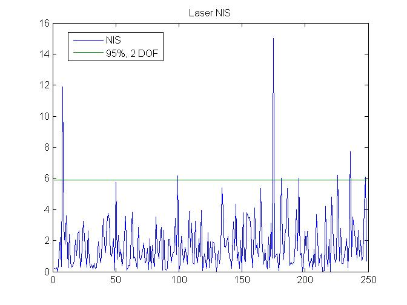
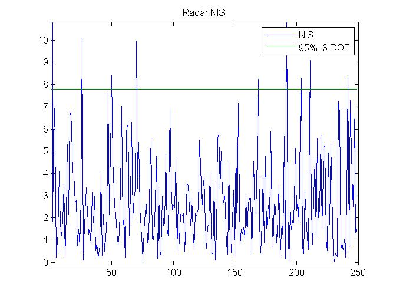
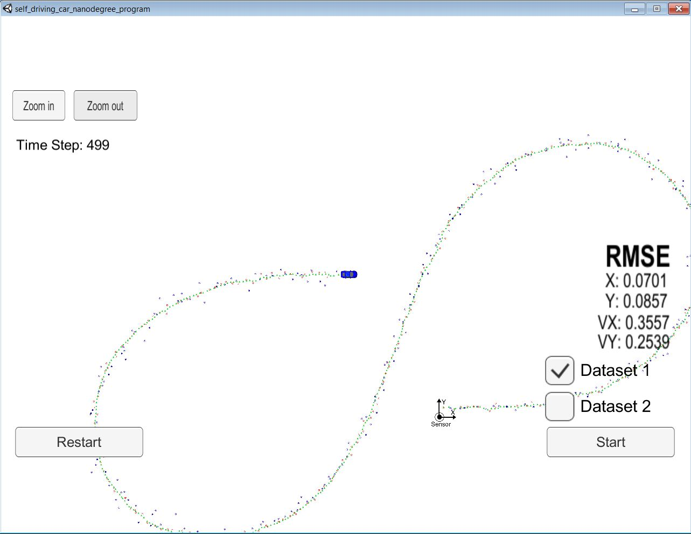

# Unscented Kalman Filter Project
Self-Driving Car Engineer Nanodegree Program

In this project I utilize an Unscented Kalman Filter to estimate the state of a moving object of interest with noisy lidar and radar measurements. Passing the project requires obtaining RMSE values that are lower that the tolerance outlined in the project rubric. 

My setup is done using windows with docker installed. The remaining setup was done as a linux system.

The programs that are written to accomplish the project are src/ukf.cpp and tools.cpp

Following changes were done in the files.
### `src/ukf.cpp`
1. Inside `constructer()`, finished initializing the UKF by setting up parameters like is_initialized_, time_us_, n_aug_, lambda_ etc.
2. Inside function `ProcessMeasurement()`, initializes state using measurements and process noise. If rader then first converted radar measurements from polar to cartesian coordinates.
3. Inside function `ProcessMeasurement()`, call 'Prediction()' and 'UpdateRadar()` or `UpdateLidar()'. Update is done depending on the type of measurement.
4. Completed function 'Prediction()' by implementing 3 steps in prediction; Generate Sigma Points, Predict Sigma Points, Predict Mean and Covariance.
5. Completed functions 'UpdateRadar()' and `UpdateLidar()` by implementing 2 steps; Predict Measurement, Update State
6. NIS is also calculated for radar and laser in functions 'UpdateRadar()' and `UpdateLidar()` separately.  

### `src/tools.cpp`
1. Implemented function to calculate the RMSE

## Project Instructions and Rubric

1. The code compiles using the standard method of executing command `cmake .. && make` from the folder `build`. After successful compilation run `./UnscentedKF` to start the executable.

2. For the initial values of process noise, the simulater stopped after few steps. This was because estimations were way off from ground truth. By reducing the process noise the simulator was able to run for all steps. Fine tuning of values was done 
by looking at the values of NIS.  Final values chosen are `std_a_ = 2` and `std_yawdd_ = 2`.  The final plots of NIC are shown in the following images.

3. After tuning, running against Dataset 1 in the simulator the RMSE for all states are found within acceptable limits. The results after the run is complete are shown in the following image.

4. The algorithm follows the standard procedure of running the kalman filter. 
	1. Uses  first measurements to initialize the state vectors and covariance matrices.
	2. Then the algorithm predicts object position to the current timestep and then update the prediction using the new measurement.
	3. Algorithm sets up the appropriate matrices given the type of measurement and calls the correct measurement function for a given sensor type.
 
5. In the code there is no manner when previous information is stored, neither loops are implemented. The implementation is done by the books and kept straight forward.

